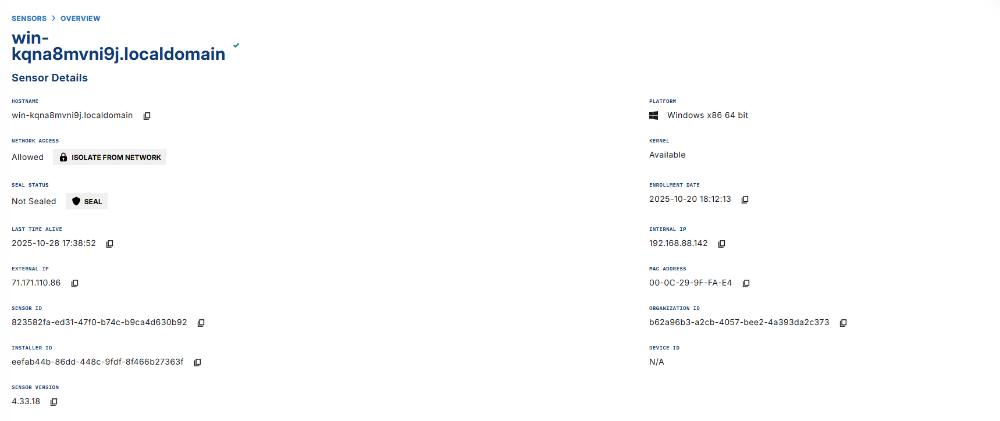
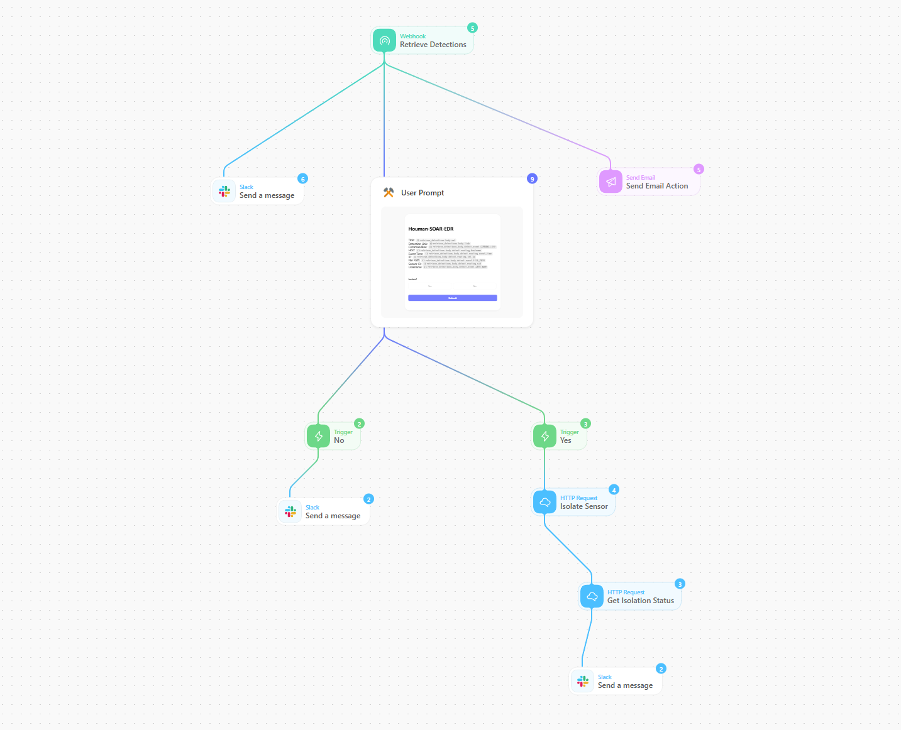
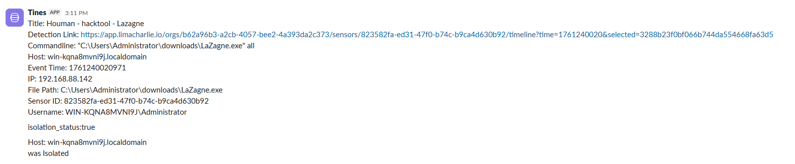

# SOAR-EDR
This SOAR-EDR integration project leverages Tines for security orchestration and LimaCharlie for endpoint detection to create an automated incident response pipeline that identifies and contains infected machines.
When LimaCharlie detects malicious activity, it triggers a Tines workflow that enriches the alert, and automatically isolates compromised endpoints upon approval.The Tines playbook also genertaes alerts via Slack and email.
# LimaCharlie

# Tines

# Slack Alerts

